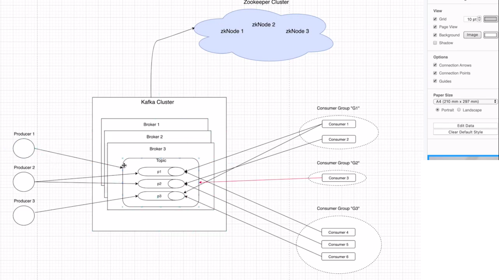

**Kafka 

Kafka is a distributed messgaing stream platform that uses pulish and subscribe mechanism to stream the records.

Kafka architecture

Important components of Kafka::
1.) Zookerper cluster: responsible to monitor Kafka cluster & co-ordinate with each broker.
			keeps all metadata info related to Kafka clusterin the form of key-value pair.
			Used for the controller election with kafka cluster.
			A set of zookeper nodes to manage distributed system are known as Zookere cluster
2.) TOPIC : A set of messages belongs to the particular category. must be UNIQUE
3.) Partitions: Topics are split in partitions. 
		All the messages within partition is ordered and immutable.
		Each messgae within a partition will have a unique ID associated known as OFFSET.
4.) Replica & Replication:
		Replicas are backup of partitions
		Replicas are never read or write. used to prevent data loss (Fault tolerance)
e.g partition=3, broker =3 & replicas=2 => means 9messages from 1 topic wil be distributed 3 messages each partition(P0,P1,P2). each partition will be available on 2 brokers a a time . possibility B0=>P0,P2, B1=> P1,P2, B3 => P3,P0

5.) Producers: Applications which sends the data to Topic or partitions directly
6.) Consumers: Applications which consumes the data to Topic or partitions directly. Always will be associated to Consumer group

7.) Brokers: are simple software processes which maintain & manage the published messages
		Also known as Kafka servers
		Brokers also manages the CONSUMER OFFSET and are responsible for the delivery of messages to the right consumers.
		A set of Brokers who are communicating with each other to perform the management & maintain tasks are collectively known as 			"KAFKA CLUSTER". we always can add more cluster without any downtime.
	
Core API's provide by Kafka:
Producer API's	
Consumer API's
Streams API's
Connector API's
Admin API's

****Imp OFFSETS
The records in the PARTITIONS are each assigned a sequential id number called  the OFFSET tha uniqely identifies each record within the partition.

varients of offset:
* Log-end offset: Offset of the last message written in the partition i.e total no of messages in partition
* current offset: pointer to the last record that Kafka has already sent to a consumer in the most recent poll. i.e how many messages sent to the consumer group tilll now.
* commited offset: Marking an offset as consumed is called commiting an offset(Commited offset). i.e how many of sent messages to consumer group Have kafka cluster got the ACK that message has been consumed.
ACK --> (1. auto-commit , 2 -> Manual commit (2.1 send commit for each n every message as soon as consumed 2.2 wait for 15-20 messgaes(batch) and send ACK for that particular batch at once)

producer(sends {key:null,payload:"message"} --> what Broker saves {key, payload, topic, partition, offset, timestamp}
if key is non-null only specific partition will get the data , if null then in round robin data will be sent to partition

Consumer group rebalancing -> if any consumer adds/removes from a consumer group. if any partion add/removes
****** Steps to run this project *********
A very old producer-consumer IT problem could be easily solved using apache kafka, a highly throughput distributed streaming platform.  

1.) download apache kafka
2.) create a user kafka --optional step but recommended
	on linux ... sudo adduser kafka => passwd kafka ==> useradd sudo ==> su -l kafka
3.) start the zookeeper instance
	./bin/zookeeper-server-start.sh config/zookeeper.properties 
	by deafult zookeeper instance will run at 0.0.0.0:2181
4.) start the kafka instance
	./bin/kafka-server-start.sh config/server.properties
	some imp variables in server.prop u need to change:
	broker.id, listners(this broker will listne on this port),zooker.connect(zookerpaddress), logs.dir(where msgs stores), log.retentions.hours
	deafult : localhost:9092

5.) create two new TOPIC
	./bin/kafka-topics.sh --create --zookeeper localhost:2181 --replication-factor 1 --partitions 1 --topic TOPIC
	Created topic TOPIC.
	&&&&
	./bin/kafka-topics.sh --create --zookeeper localhost:2181 --replication-factor 1 --partitions 1 --topic JSON_TOPIC
	  	Created topic JSON_TOPIC.
6.) Run the spring project kafka-project
7.) Hit the below endpoints
	http://localhost:8080/profile/abhishek
	http://localhost:8080/post/abhishek
	Above endpoints will produce a message in the corresponding topics. 
8.) Consumer will pick up the messages on Topic and will be visinle in the console output.

********************************Fault tolerance ******************************************************
Producer config acks flag ==> 0,    ==> producer will not wait for ACK , highest throughput, chances of data lost
							  1,	==> producer will wait for ACK , slightly lower throughput, lower chances of data lost(If leader sends ACK but leader crashes before passing data to followers , Data is lost even after the ACK)
							  all   ==> producer will wait for ACK , slightly lower throughput, No chance of data lost 

********************************Fault tolerance ******************************************************
replication factor =3 i.e 3 copies will be created and distributed across 3 broker in a cluster.
how can we achieve this in kafka? ==> Leader will have main copy - follower will copy the data.

1.) create 3 broker list 
2.) create 2 more server.properties for the new brokers
	server1.properties & server2.properties
3.) change below properties in properties file
	broker.id =1
	listners = PLAINTEXT://9093 and listners = PLAINTEXT://9094
	log.dirs = /tmp/kafka-logs2
4.) start the 2 new brokers 
./bin/kafka-server-start.sh config/server1.properties
./bin/kafka-server-start.sh config/server1.properties
5.) Now we have 3 node clusters with 1 Leader and 2 Followers (based on selection )
6.) Now create a topic with replication factor 
	./bin/kafka-topics.sh --create --zookeeper localhost:2181 --replication-factor 3 --partitions 2 --topic TOPIC
	Created topic TOPIC.
7.) you can check the TOPIC using describe command, 
./bin/kafka-topics.sh --create --zookeeper localhost:2181 --describe --topic TOPIC   which will show you below,
	Topic: TOPIC Partition:0, Leader: 1, Replicas:1,2,0 , ISR: 1,2,0 (In-sync-Replicas i.e all broker is in sync with leader)
	Topic: TOPIC Partition:1, Leader: 2, Replicas:2,0,1 , ISR: 2,0,1
	
**********************Rebalancing********************
commited offset Avoids to send the same record to new COnsumer in case of partition re-balancing 
current offset: sent records (already read by consumers)
commited offset	: Processed records (already committed by consumers)

ways to commit offset:
Auto Commit:
	enable.auto.commit : bydeafault true
	auto.commit.interval.ms
Manual Commit:(commit asyn/commit sync)
	enable.auto.commit = false
	
	in COnsumer try{}
				finally{ consumer.commit(/A)Sync();} 

Kafka provides ConsumerrebalanceListner class with 2 methods
			onPartitionsRevoked()   ==> consumer can commit offset before Group co-ordinator takes partiotion from it.
			onPartitionsAssigned()
									  
							  
